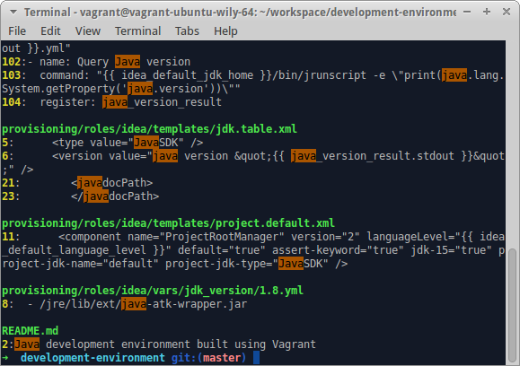
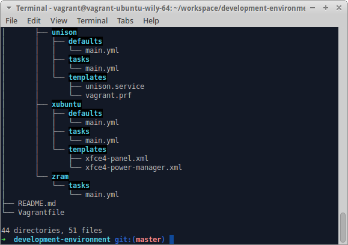
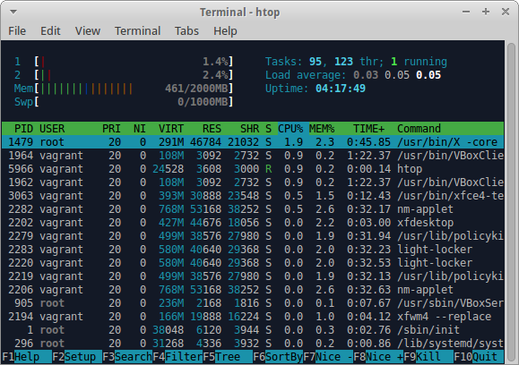
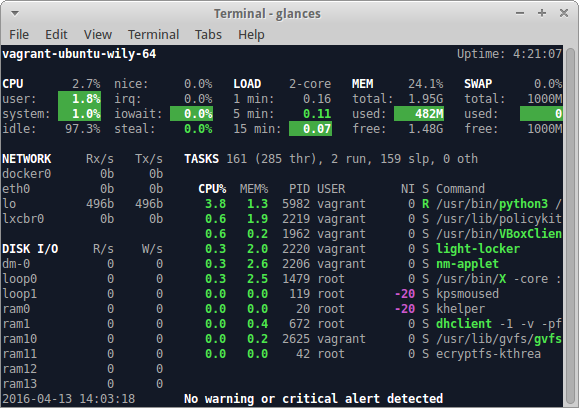
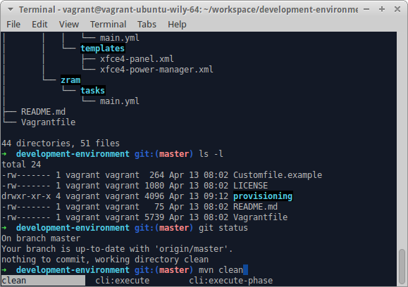
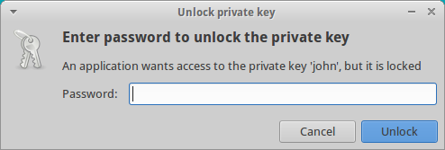
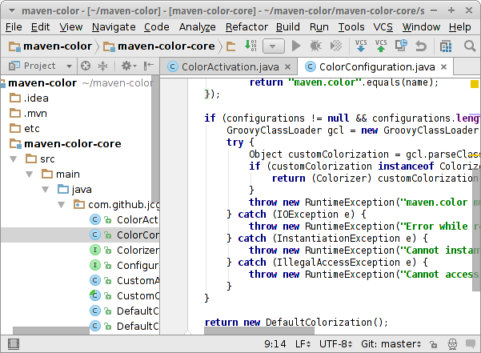
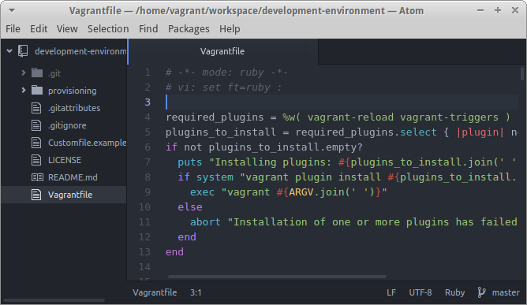
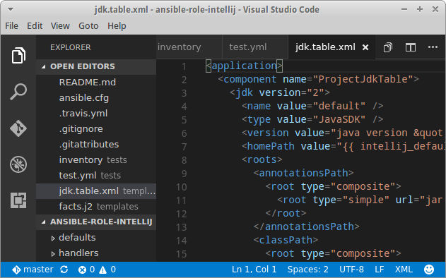
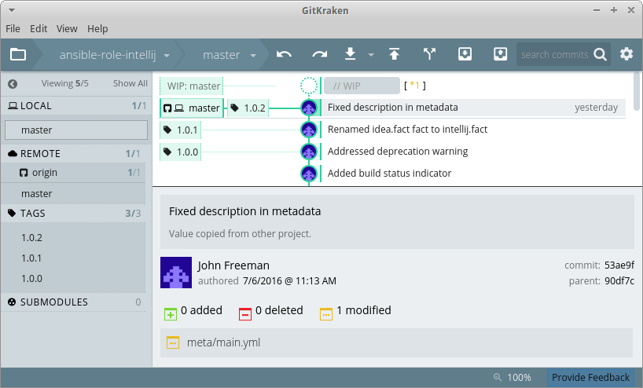

# Java Development Environment

[](https://travis-ci.org/gantsign/development-environment)

Getting your development environment setup correctly can be a time consuming and
error prone process; getting everyone on a team to setup their environment
correctly is even more challenging. The goal of this project is to make setting
up a development environment reliable and reproducible. This project provides a
generic development environment you can fork to add your project specific
configuration.

## Requirements

### Vagrant

Website: https://www.vagrantup.com

Vagrant enables users to create and configure lightweight, reproducible, and
portable development environments.

### VirtualBox

Website: https://www.virtualbox.org

Multi-platform virtualization provider with excellent integration with
Vagrant.

## Oracle Binary Code License Agreement

To install the Oracle JDK you must accept the "Oracle Binary Code License
Agreement for the Java SE Platform Products and JavaFX"; you can do this by
specifying the following variable in the `.vagrantuser` file (either in
the project root directory or your user home directory):

```yaml
---
java_license_declaration: 'I accept the "Oracle Binary Code License Agreement for the Java SE Platform Products and JavaFX" under the terms at http://www.oracle.com/technetwork/java/javase/terms/license/index.html'
```

## Features

There are a lot of hidden gems out there to aid in your productivity; this
project aims to install the best of them to make life a little easier.

### Compressed RAM

Website: https://www.kernel.org/doc/Documentation/blockdev/zram.txt

Unless you have 16GB of RAM you're probably going to struggle to run VirtualBox,
your IDE, a Maven build, your application and a few services in Docker at the
same time. Enabling RAM compression in the virtual machine is going to stretch
the RAM significantly further. Essentially this create a virtual swap disk
backed by compressed RAM; this is typically much faster than disk based swap,
particularly on machines with fast CPUs. Given Java applications tend to reserve
a lot more RAM than they end up using, they benefit more from RAM compression
than native applications.

### File synchronization

Website: https://www.cis.upenn.edu/~bcpierce/unison

One of the advantages of a using a virtual machine for your development
environment is it's easy to get back to a clean working state by rebuilding the
virtual machine. The downside of this is it may require a certain amount of
manual setup after the rebuild (e.g. SSH keys, Git username and email, cloning
projects, etc.). If you keep all your working directories on the the client VM
you'd also loose anything that hasn't been pushed to a remote server when you
rebuild the virtual machine.

To reduce the amount of manual setup post-rebuild, and keep any local code, this
project uses `unison` to synchronize (in real-time) selected files and folders
from the client to the host machine. When the virtual machine is rebuilt the
copies of these files and folders on the host are copied back the the client
virtual machine. The `unison` synchronization tool allows the use of exclusion
patterns to avoid duplicating compiled artifacts; this reduces unnecessary I/O
and disk usage on the host.

### Linux command line tools

#### The Silver Searcher

Website: http://geoff.greer.fm/ag

If you've used Linux you've almost certainly used `grep`, but you've probably
never heard of `ag` (The Silver Searcher). While `grep` is a great general
purpose tool, `ag` is a specific tool for finding matching text in a directory
tree (with slightly nicer output). Note: `ag PATTERN` is roughly equivalent to
`grep --recursive --ignore-case --line-number PATTERN`.

Below is the output of the command `ag java` on this project:



Note: if you have multiple pages of output you may want to use
`ag --pager=less PATTERN`.

#### Tree

Website: http://mama.indstate.edu/users/ice/tree

The `tree` command is similar to `find .` but a graphical tree style output.

Below is the output of the command `tree` on this project:



Note: if you have multiple pages of output you may want to use
`tree -C | less -R`.

#### htop

Website: http://hisham.hm/htop

You may have used `top` to view what is hogging all of your CPU, or to see how
much RAM is free. The `htop` command is essentially a `top` replacement with a
better looking user interface and a few more features.



#### Glances

Website: https://nicolargo.github.io/glances

If you want a broader view of what's going on on your system than `top` or
`htop` provide you can try `glances`. The `glances` application shows disk I/O,
network I/O, warnings/alerts, in addition to RAM and CPU usage.



#### Oh-my-zsh

Website: http://ohmyz.sh

Rather than a specific command, oh-my-zsh changes your default shell from `bash`
to `zsh` and customizes the `zsh` shell with themes to enhance your command
prompt and plugins to enable better tab completion etc.



#### CDPATH

Website: http://zsh.sourceforge.net/Intro/intro_13.html

This environment variable changes how tab completion and the `cd` command works.
The `CDPATH` environment variable allows you to provide a list of directories
to search in addition to the current directory when changing directory. By
adding the `/home/vagrant/workspace` directory to this path you can `cd` into
any of your project folders (assuming they are sub-directories of `workspace`)
from any directory in the file system.

### X Windows desktop

#### Xubuntu Core

Website: http://xubuntu.org

Lightweight X desktop with a minimal number of packages installed. Xubuntu
uses [Xfce](http://www.xfce.org), which provides a more traditional desktop
experience than the standard [Unity](http://unity.ubuntu.com) desktop on Ubuntu.

#### DockbarX

Website: https://github.com/M7S/dockbarx

Integrates with the Xfce Panel to provide a modern dockbar interface for
launching and switching between applications.

#### Seahorse

Website: https://wiki.gnome.org/Apps/Seahorse

Graphical user interface for managing your keys and SSH agent to save you having
to put in your SSH password more than once in the same session.



### Maven extensions

#### Maven Color

Website: https://github.com/jcgay/maven-color

Makes your Maven console output more readable by adding color.


#### Maven Notifier

Website: https://github.com/jcgay/maven-notifier

One for all you multi-taskers; if you like to check your email while waiting for
a long build to finish, this extension will trigger a popup notification to let
you know when the build is complete.


### Development tools

#### IntelliJ IDEA IDE

Website: https://www.jetbrains.com/idea

In my opinion IntelliJ IDEA is the best Java IDE available. While the Community
Edition is excellent at what it does, you need to pay for the Ultimate Edition
if you want support for common tools/frameworks such as the JavaEE and the
Spring Framework; the relatively small price for the Ultimate Edition is well
worth the money. By default the Community Edition is installed.



#### Atom

Website: https://atom.io

An extremely powerful text editor with tons of available plugins.



#### Visual Studio Code

Website: https://code.visualstudio.com

Similar to Atom, fewer plugins available but generally more polished for the
languages that it does support. It also has excellent built-in Git support.



#### GitKraken

Website: https://www.gitkraken.com

A user friendly Git GUI client.



## Installation

* Install Git https://git-scm.com/
* Install Vagrant https://www.vagrantup.com
* Install VirtualBox https://www.virtualbox.org

Run the following from the host machine command prompt:

```
git clone https://github.com/GantSign/development-environment.git
cd development-environment
vagrant up
```

## Using the development environment

All the following commands must be run from the `development-environment`
directory.

### To start the development environment

```
vagrant up
```

### To stop the development environment

```
vagrant halt
```

### To remove the development environment

```
vagrant destroy
```

## Customizing the provisioning

The provisioning is done using Ansible (https://www.ansible.com/).

If you want to customize the provisioning the place to start is the
`provisioning/playbook.yml` file.

[](https://github.com/igrigorik/ga-beacon)
